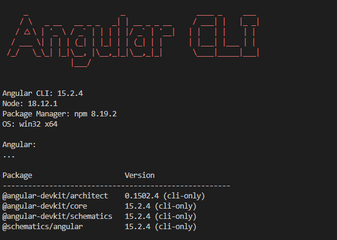
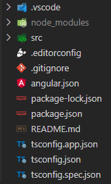

# TP1

**Avant de commencer**, Il faut ajouter l’extension **Angular Language Service** `Angular.ng-template` à votre IDE.

Cette extension permet d'ajouter des fonctionnalités à votre IDE pour améliorer le développement d’application **Angular**. (détection d'erreur dans vos templates, autocomplétions ...)

`Angular` est un **cadriciel** et une **plate-forme de développement** permettant de créer des **applications Web complexe et évolutive**.

Il possède de nombreuses bibliothèques et outils officielles (maintenues par les équipes Core de Angular) qui facilitent la création d’application et améliore l'expérience de développement.

La CLI Angular est un **outil d'interface en ligne de commande** que vous pouvez utiliser pour `initialiser`, `développer`, `faire évoluer` et `maintenir` des applications Angular directement à partir d'un **invite de commande**.

Pré-requis (installés):

- NodeJS
- Node Package Manager (NPM)

## 0 - Installation de la CLI Angular

Ouvrez un `terminal/invite de commande` et tapez la commande ci-dessous :

```bash
npm install -g @angular/cli
```

`-g` permet d'**installer la CLI en global** sur notre poste.

On peut maintenant utiliser la CLI Angular n'importe où sur notre poste via la commande `ng`.

Pour vérifier la version de Angular CLI installée, tapez la commande :

```bash
ng version
```



## 1 - Création d'un projet Angular

Maintenant, nous allons créer notre **première application Angular** à l'aide de la CLI via la commande :

```bash
ng new <mon_nom_de_projet> --standalone false
```

PS: nous désactivons le mode standalone et nous verrons cette nouvelle fonctionnalité de Angular plus tard. :)

Répondez aux questions avec les valeurs suivantes :

```bash
? Which stylesheet format would you like to use? CSS
? Do you want to enable Server-Side Rendering (SSR) and Static Site Generation 
(SSG/Prerendering)? No
```

Pensez bien à vous positionner dans le dossier du projet après ça création

```bash
cd <mon_nom_de_projet>
```

La CLI a généré un projet complet avec les fichiers suivants :



Prenez le temps de comprendre chacun des fichiers et leurs utilités.

<details>
<summary>Réponses</summary>

```bash
- `.vscode (dossier)` : Configuration de VSCode pour ce projet
- `node_modules (dossier)` : Toutes les dépendances du projet
- `src (dossier)` : Toutes les sources du projet
- `.editorconfig` : Configuration du formatage de VSCode
- `.gitignore` : Configuration de Git (fichiers ignorés)
- `package.json` : Configuration de NPM
- `package-lock.json` : Fichier représentant l arborescence complète de nos dépendances installées
- `README.md` : Documentation pour démarrer le projet
- `tsconfig.app.json` : Fichier de configuration Typescript pour notre app
- `tsconfig.json` : Fichier de configuration Typescript global
- `tsconfig.spec.json` : Fichier de configuration Typescript pour nos tests
```

</details>

Que voyez vous dans le dossier `src` ?

<details>
<summary>Réponses</summary>

```bash
- `App (dossier)` : Toutes les briques logicielles de notre programme
- `assets (dossier)` : Tous les fichiers statiques (css, images, fonts ...)
- `favicon.ico` : Icône affichée dans l onglet de notre page
- `index.html` : Page HTML de notre site Web
- `main.ts` : Point d entrée de notre programme Angular
- `styles.css` : Fichier de style global
```

</details>

Prenez le temps de lire le `README.md`.

## 2 - Tests de plusieurs commandes de la CLI dans notre projet

### Helper

Pour afficher les différentes commandes disponibles :

```bash
ng --help
```

Les commandes à retenir :

```bash

# ng build => Build l'application
# ng serve => Build et démarre l'application
# ng test => execute les tests dans le projet
# ng lint => lance les linters
# ng add ... => permet d'ajouter une fonctionnalité dans notre projet
# ng update => permet de mettre à jour son projet Angular
```

Vous pouvez trouver la liste exhaustive des commandes dans la [documentation de la cli](https://angular.io/cli#command-overview).

### Serve

Démarrez le projet en exécutant la commande :

```bash
ng serve
```

<a href="http://localhost:4200" target="_blank" rel="noreferrer">Naviguez vers la page.</a>

Ouvrez le fichier `src/app/app.component.html` et cherchez comment la valeur **<mon_nom_de_projet> app is running!** est affichée.

<details>
<summary>Réponses</summary>
<p>Elle utilise l'<b>interpolation</b> en injectant la valeur de la variable <b>title</b> présente dans le fichier <i>src/app/app.component.ts</i> dans le template.</p>
</details>

### Build

Construisez votre projet via la commande :

```bash
ng build
```

Un dossier `dist` a été généré à la racine. Analysez les différents fichiers créés.

Ces fichiers sont `uglifiés` pour rendre la compréhension du code plus complexe et également `minifiés` pour réduire leurs tailles.

<details>
<summary>Réponses</summary>

```bash
- `favicon.ico` : Icône affichée dans l onglet de notre page
- `index.html` : Page HTML de notre site Web
- `main.[hash].js` : Fichier js comprenant le code de notre application
- `polyfills.[hash].js` : Fichier js comprenant les bouts de code utilisé pour fournir des fonctionnalités récentes sur d anciens navigateurs qui ne les supportent pas nativement.
- `styles.[hash].css` : Fichier de style global
```

</details>
